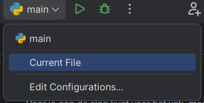

# README.md

Welkom in de README.md! De meeste repositories (hierin bewaren we code), 
bevatten zo'n README, zodat we snel aan de slag kunnen met het programma.

Deze repository bevat met name informatie voor studenten die beginnen met programmeren. In 
de [navigatie](#navigatie) kun je meer handige informatie vinden voor het vak. Daarnaast zal deze 
repository voorbeelden met code bevatten, zodat je altijd terug kunt kijken op wat 
we in de lessen hebben laten zien.

---

## Navigatie

- [Je eerste code schrijven](#je-eerste-code-schrijven)
- [Hoe schrijf je een README](#een-readme-schrijven)
- [Tips bij vragen](#tips-bij-vragen)

---

## Je eerste code schrijven

Voor je aan de slag kunt voor het vak, moet je een paar dingen regelen. 
Binnen de HU werken we met PyCharm, maar je mag ook een andere editor gebruiken. 
De installatie hiervoor zul je dan zelf moeten regelen.

1. [Installeer PyCharm](#installeer-pycharm)
2. [(Optioneel) installeer Python globaal](#python-globaal-installeren)
3. [Code schrijven en uitvoeren](#code-schrijven-en-uitvoeren)

### Installeer PyCharm

Jullie ontvangen een JetBrains-licentie om PyCharm Professional te kunnen gebruiken. Je kunt 
het programma [hier](https://www.jetbrains.com/pycharm/download) downloaden. 

PyCharm is een zogenaamde IDE, of Integrated Development Environment. Hierin kun je programmeren en code uitvoeren. 
Later leren we ook omgaan met git & GitHub en leren we je om te gaan met verschillende versies en het werken in teams.

We onderscheiden voor nu twee onderdelen:

1. De editor: hierin schrijf je code
2. De terminal: hierin voer je de code uit.

### Python globaal installeren

Python wordt geïnstalleerd door PyCharm, maar is dan nog niet overal te gebruiken. PyCharm 
werkt met zogenaamde virtual environments ([Leestip](https://www.linkedin.com/pulse/virtual-environments-python-simplified-beginners-globaltechcouncil-qjptc)). 
Via de [officiële website](https://www.python.org/downloads/) van Python kun je ook versies downloaden om overal op je computer 
te gebruiken. 

Let op: het proces hiervoor verschilt erg per operating systeem. Op Windows 
moet je bijvoorbeeld de geïnstalleerde versie van Python nog [toevoegen aan je PATH](https://www.eukhost.com/kb/how-to-add-to-the-path-on-windows-10-and-windows-11/). 
Bij installaties verzeker je hiermee dat Windows weet dat dit specifieke programma overal (of overal binnen jouw gebruiker) 
aangeroepen mag worden.

### Code schrijven en uitvoeren

Als je PyCharm werkend hebt, kun je nu code gaan schrijven. Rechtsbovenin 
kun je selecteren welke code je uit wil voeren. Later kunnen we hier ook configuraties aan toevoegen. Voor nu is het makkelijkst om deze op `Current File` te zetten, zodat 
je altijd de code draait die je op dat moment voor je hebt.

---

## Een README schrijven

Een README bevat meestal:
- Een korte introductie van het project
- De auteurs van het project
- Instructies om het programma zo te draaien als bedoeld door de programmeurs.

In de praktijk zien we dat auteurs vaak ook geavanceerde opmaak gebruiken om bijvoorbeeld knopjes, sponsoring en 
meer toe te voegen. Voor een simpele README voor je opdrachten is dat natuurlijk niet nodig. 
Het is met name belangrijk dat je docenten weten wat ze moeten installeren, welke code ze moeten draaien en 
eventueel welke informatie hierbij hoort.

Een README is een voorbeeld van een bestand geschreven in [Markdown](https://www.markdownguide.org/cheat-sheet/), 
een simpel te leren systeem waarmee je simpele opmaak (en ingewikkeldere, met wat meer oefening) 
toe kunt passen op tekst. Markdown is geen programmeertaal, maar wordt ook wel een mark-up language genoemd, 
omdat deze styling toepast op tekst. Misschien ken je het zelfs al; het wordt onder andere gebruikt op Reddit en Discord! 

Het is geschikt voor notities, maar kan bijvoorbeeld ook 
gebruikt worden om de content van een webpagina in te schrijven.

---

## Tips bij vragen

- Als je een vraag stelt, vermeldt dan altijd de error en de code die de fout veroorzaakt. Dit helpt ons enorm om jou te helpen.
- Check op spelfouten, komma's i.p.v. punten en andere kleine verschillen
- Check of je variabelen en scripts geen namen gebruiken die gereserveerd zijn in Python
  - Namen van libraries
  - If/else/while/for/and/or/not/def en alle andere woorden die highlighten
  - Variabelen mogen niet beginnen met een getal.
- Wees niet bang om je leerteam aan te spreken! Programmeren is lastig en de meeste van jullie beginnen vanaf 0!